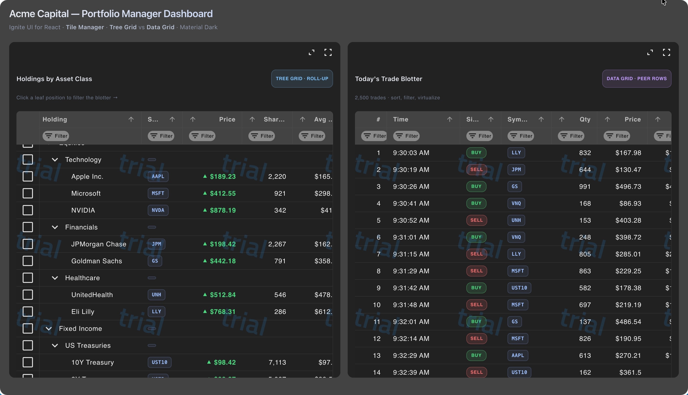

# React Financial Dashboard — React Data Grid + React Tree Grid Sample (Ignite UI for React)

> A production-grade **React fintech trader sample app** built with the **Ignite UI for React Data Grid** and **React Tree Grid**, featuring a hierarchical portfolio roll-up, a high-volume trade blotter, conditional up/down cell styling, a resizable Tile Manager layout, and the Material Dark theme.

**🚀 Live demo:** **[https://react-grids.github.io/igr-datagrid-treegrid/](https://react-grids.github.io/igr-datagrid-treegrid/)**



---

## What this sample shows

This is a real-world **React trader dashboard** that demonstrates when to reach for a **React Data Grid** versus a **React Tree Grid** — the single most common question developers ask when building financial, trading, portfolio management, and back-office apps in React. It pairs both grids inside a responsive **Tile Manager** so you can see the APIs, performance, and UX trade-offs side by side.

If you're evaluating **React grid components for fintech**, **React portfolio management UIs**, **trade blotters**, **order management systems (OMS)**, **risk dashboards**, or **brokerage back-office tools** — this is the reference implementation.

### Live features

- **React Tree Grid** — hierarchical holdings rolled up by asset class → sector → position (Equities → Technology → AAPL) with expand/collapse, filtering, sorting, and row selection.
- **React Data Grid** — flat, virtualized trade blotter rendering thousands of trades with sorting, filtering, and column resizing at 60fps.
- **Cross-grid interaction** — clicking a leaf position in the Tree Grid filters the Data Grid blotter to that symbol.
- **Tile Manager** — the grids live inside a resizable, fullscreen-capable `IgrTileManager` so users can maximize either pane.
- **Conditional cell styling** — fintech up/down red/green arrows for P&L, Day Change %, Price vs Average Cost, and YTD return. BUY/SELL pills, ticker chips, rating badges.
- **Material Dark theme** — Ignite UI's built-in dark material theme.
- **Small size density** — compact row height for information-dense blotters (`--ig-size: var(--ig-size-small)`).

---

## Why Ignite UI for React for financial applications

| Need | Why it matters for fintech |
| --- | --- |
| **Virtualized React Data Grid** | Trade blotters, order books, and market-data ticks routinely hit tens of thousands of rows. Ignite UI's grid virtualizes rows and columns so scroll performance stays flat. |
| **React Tree Grid with roll-up** | Portfolios, general ledgers, and risk hierarchies are inherently parent-child. The Tree Grid gives you expand/collapse and aggregate rows with the same column API as the flat grid. |
| **Conditional cell templates** | P&L, Δ%, price-vs-cost — every blotter needs cell-level red/green formatting. Ignite UI columns accept React body templates so you get full JSX control. |
| **Tile Manager** | Traders expect Bloomberg-style multi-pane layouts with drag/resize/fullscreen. `IgrTileManager` ships that out of the box. |
| **Theming** | Built-in Material, Fluent, Bootstrap, and Indigo themes in light and dark variants, all driven by CSS custom properties for easy brand customization. |
| **100+ components** | Charts, financial charts, pivot grid, date pickers, dialogs, toasts — one library for an entire trading UI. |

---

## Tech stack

- **[Ignite UI for React](https://www.infragistics.com/products/ignite-ui-react)** — `igniteui-react`, `igniteui-react-grids`
- **[React Data Grid](https://www.infragistics.com/products/ignite-ui-react/react/components/grids/grid/overview)** (`IgrGrid`) — virtualized, sortable, filterable flat data grid
- **[React Tree Grid](https://www.infragistics.com/products/ignite-ui-react/react/components/grids/tree-grid/overview)** (`IgrTreeGrid`) — hierarchical grid with roll-up parent rows
- **[React Tile Manager](https://www.infragistics.com/products/ignite-ui-react/react/components/layouts/tile-manager)** (`IgrTileManager`) — resizable, draggable tile layout
- **[Material Dark theme](https://www.infragistics.com/products/ignite-ui-react/react/components/grid-lite/theming)** — dark-mode tuned for financial displays
- **React 19**, **TypeScript**, **Vite 8**

---

## Getting started

```bash
git clone https://github.com/react-grids/igr-datagrid-treegrid.git
cd igr-datagrid-treegrid
npm install
npm run dev
```

Open <http://localhost:5173> and you'll see the dashboard.

### Build for production

```bash
npm run build
npm run preview
```

Production build is deployed to GitHub Pages automatically via `.github/workflows/deploy.yml` on every push to `main`.

---

## Code highlights

### React Tree Grid with a hierarchical portfolio

```tsx
import { IgrTreeGrid, IgrColumn } from 'igniteui-react-grids';
import 'igniteui-webcomponents-grids/grids/themes/dark/material.css';

<IgrTreeGrid
  data={portfolio}
  childDataKey="children"
  autoGenerate={false}
  allowFiltering={true}
  rowSelection="single"
>
  <IgrColumn field="name"        header="Holding"      dataType="string"   sortable />
  <IgrColumn field="symbol"      header="Symbol"       dataType="string"   bodyTemplate={symbolTemplate} />
  <IgrColumn field="price"       header="Price"        dataType="currency" bodyTemplate={priceTemplate} />
  <IgrColumn field="marketValue" header="Market Value" dataType="currency" />
  <IgrColumn field="pnl"         header="Day P&L"      dataType="currency" bodyTemplate={pnlTemplate} />
  <IgrColumn field="change"      header="Chg %"        dataType="number"   bodyTemplate={changeTemplate} />
</IgrTreeGrid>
```

### React Data Grid as a virtualized trade blotter

```tsx
<IgrGrid
  data={trades}
  primaryKey="id"
  allowFiltering={true}
  height="100%"
>
  <IgrColumn field="time"     header="Time"     dataType="time" />
  <IgrColumn field="side"     header="Side"     bodyTemplate={sideTemplate} />
  <IgrColumn field="symbol"   header="Symbol"   bodyTemplate={symbolTemplate} />
  <IgrColumn field="price"    header="Price"    dataType="currency" />
  <IgrColumn field="notional" header="Notional" dataType="currency" />
</IgrGrid>
```

### Conditional up/down cell template (the fintech staple)

```tsx
const pnlTemplate = (ctx) => {
  const v = ctx.cell.value;
  const cls = v > 0 ? 'pnl-up' : v < 0 ? 'pnl-down' : 'pnl-flat';
  const arrow = v > 0 ? '▲' : v < 0 ? '▼' : '■';
  return (
    <span className={`pnl-cell ${cls}`}>
      <span className="arrow">{arrow}</span>
      {fmtCurrency(v)}
    </span>
  );
};
```

```css
.pnl-up   { color: #4ade80; } /* gain  */
.pnl-down { color: #f87171; } /* loss  */
.pnl-flat { color: #8b95a8; } /* flat  */
```

### Tile Manager layout

```tsx
import { IgrTileManager, IgrTile } from 'igniteui-react';

<IgrTileManager columnCount={2}>
  <IgrTile colSpan={1}>{/* Tree Grid — Holdings */}</IgrTile>
  <IgrTile colSpan={1}>{/* Data Grid — Blotter  */}</IgrTile>
</IgrTileManager>
```

---

## When to use a React Tree Grid vs a React Data Grid

| Use a **Tree Grid** when… | Use a **Data Grid** when… |
| --- | --- |
| Data has an inherent parent-child hierarchy (portfolio by asset class, GL accounts, org chart) | Rows are peers — trades, orders, alerts, quotes, customers |
| Parent rows carry meaning — roll-up totals, aggregate exposure | Users sort, filter, and search across a flat universe |
| Users need to drill down and see structure, not just leaves | Grouping is analytical and temporary, not structural |
| Expand/collapse matches the user's mental model | High-frequency updates on a flat stream (market data, blotter) |

**Rule of thumb:** if you'd print your data as an indented outline, use a **React Tree Grid**. If you'd print it as a spreadsheet, use a **React Data Grid**.

---

## Frequently asked questions

### What is the best React data grid for financial applications?

For trading UIs, blotters, risk dashboards, and portfolio management you want a **virtualized React data grid** that can handle tens of thousands of rows, supports cell-level conditional templates for red/green P&L, and ships a matching **React tree grid** for hierarchical data. The **Ignite UI for React Data Grid** (`IgrGrid`) and **React Tree Grid** (`IgrTreeGrid`) used in this sample cover all three.

### What is the difference between a React data grid and a React tree grid?

A **React data grid** renders a flat list of peer rows — ideal for trade blotters, order books, and market data. A **React tree grid** renders hierarchical parent-child rows with expand/collapse — ideal for portfolios rolled up by asset class, general-ledger account trees, and organizational structures. Both share the same column API in Ignite UI for React, so you can swap between them without rewriting templates.

### How do I add red/green up/down arrows to a React data grid cell?

Use a **column body template** that returns JSX. Check the cell value, pick a class (`pnl-up` / `pnl-down`), and render a `▲` or `▼` glyph alongside the formatted number. See the [`pnlTemplate`](./src/App.tsx) in this repo for a working example.

### How do I put two React grids side by side with drag and resize?

Use the **Ignite UI [React Tile Manager](https://www.infragistics.com/products/ignite-ui-react/react/components/layouts/tile-manager)** (`IgrTileManager`). Each grid goes inside an `IgrTile` with a `colSpan` — the tile manager handles drag-to-rearrange, resize, maximize, and fullscreen out of the box.

### Is Ignite UI for React free?

Ignite UI for React is a **commercial product from Infragistics**. A free trial is available (this sample runs under the trial watermark as-is). Commercial licenses include priority support, indemnification, and access to premium components like the Financial Chart and Pivot Grid.

---

## Related resources

- 📘 [Ignite UI for React documentation](https://www.infragistics.com/products/ignite-ui-react/react/components/general-getting-started)
- 📘 [React Data Grid docs](https://www.infragistics.com/products/ignite-ui-react/react/components/grids/grid/overview)
- 📘 [React Tree Grid docs](https://www.infragistics.com/products/ignite-ui-react/react/components/grids/tree-grid/overview)
- 📘 [React Tile Manager docs](https://www.infragistics.com/products/ignite-ui-react/react/components/layouts/tile-manager)
- 📘 [Conditional cell styling](https://www.infragistics.com/products/ignite-ui-react/react/components/grids/grid/conditional-cell-styling)
- 📘 [Grid size & density](https://www.infragistics.com/products/ignite-ui-react/react/components/grids/grid/size)
- 📘 [Grid theming](https://www.infragistics.com/products/ignite-ui-react/react/components/grid-lite/theming)
- 🧠 [Ignite UI AI Agent Skills](https://www.infragistics.com/products/ignite-ui-react/react/components/ai/skills)

---

## Keywords

React data grid, React tree grid, React fintech, React trader dashboard, React trade blotter, React portfolio management UI, React financial dashboard, React OMS, React order management system, React risk dashboard, React brokerage UI, Ignite UI for React, Infragistics React, virtualized React grid, React grid with conditional cell styling, React hierarchical grid, React Bloomberg-style UI, React dark theme grid, React Material Dark, React Tile Manager, React dashboard layout, React 19 grid, React TypeScript grid.

---

## License

Sample code in this repository is MIT-licensed and free to copy. **Ignite UI for React** itself is a commercial product by **Infragistics** — see [licensing](https://www.infragistics.com/products/ignite-ui-react/pricing) for details. A free trial is available and this sample runs under the trial watermark out of the box.
